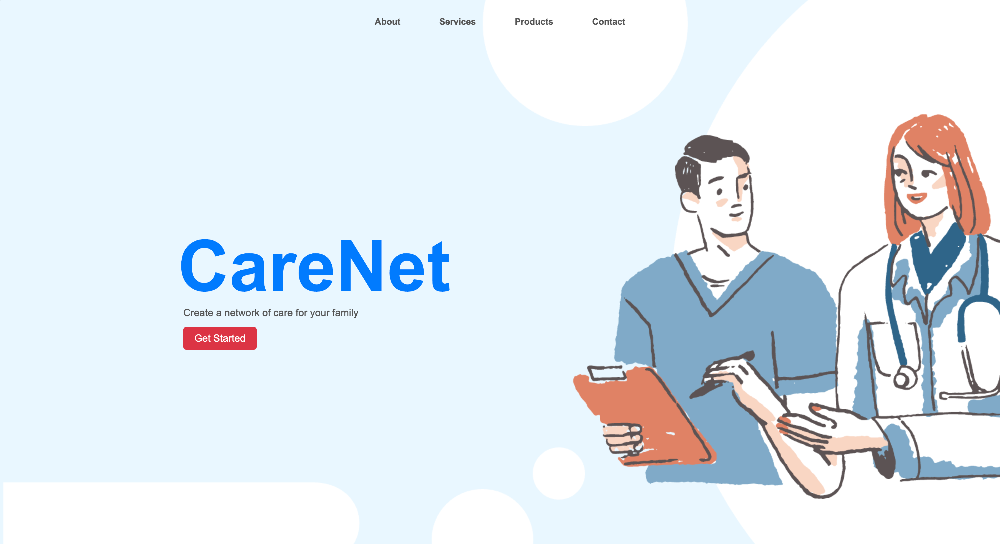
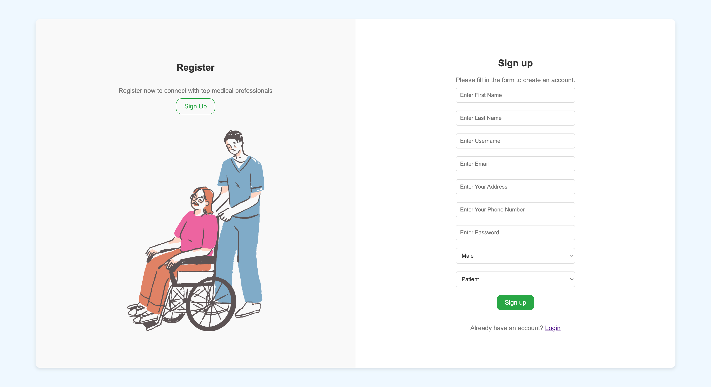
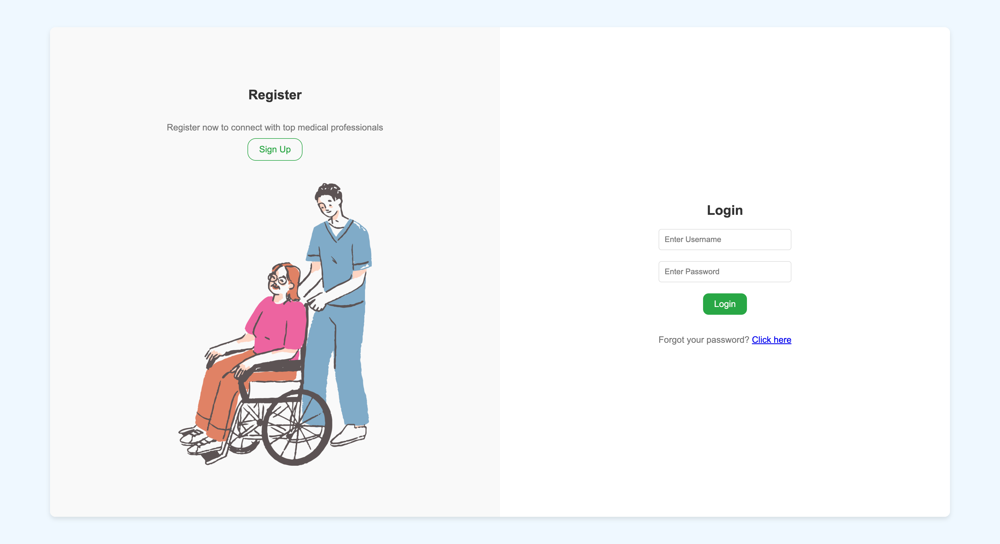
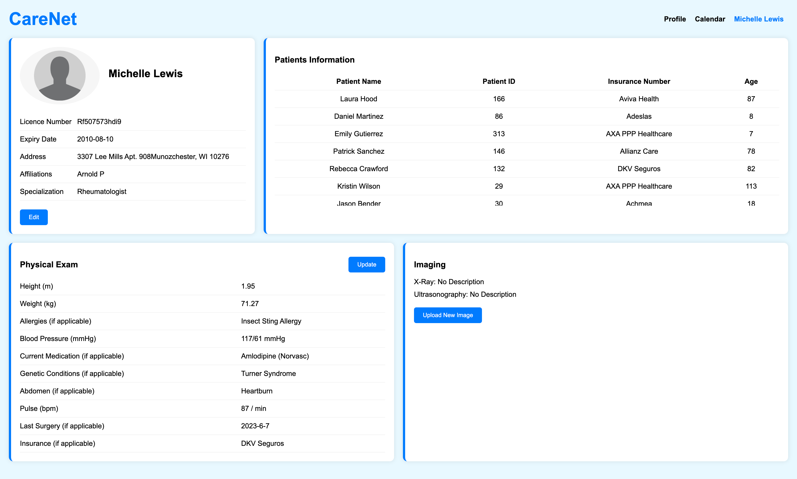
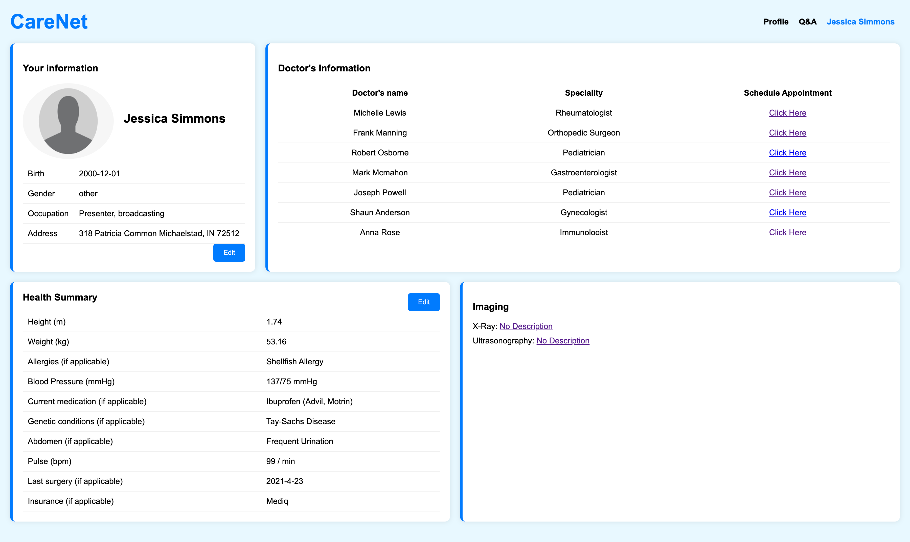
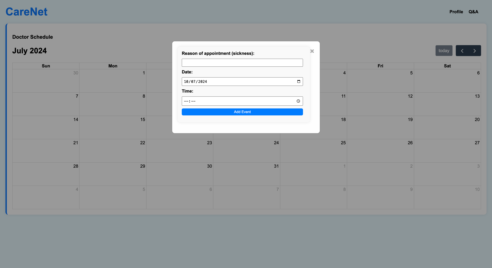

# CareNet Application

CareNet is a Struts-based web application designed to help users connect with top medical professionals. This application features registration and login functionalities.

## Project Structure

The project is structured as follows:

```
CareNet
│
├── src
│   ├── main
│   │   ├── java
│   │   │   └── it
│   │   │       └── unicas
│   │   │           ├── action # Contains all the action classes
│   │   │           │   └── UserAction.java
│   │   │           │   └── ...Action.java
│   │   │           ├── dao # Contains all the DAO classes
│   │   │           │   └── UserDAO.java
│   │   │           │   └── ...DAO.java
│   │   │           ├── model # Contains all the model classes
│   │   │           │   ├── User.java
│   │   │           │   └── ....java
│   │   │           |── utils # Contains all the utility classes
│   │   │           |   ├── DBUtil.java
│   │   │           |   └── ...Util.java
│   │   │           └── struts.xml # Contains all the action mappings
│   │   └── webapp # Contains all the web resources
│   │       ├── css # Contains all the CSS files
│   │       |   ├── images
│   │       │   |── style.css
│   │       |   └── ....css
│   │       ├── js # Contains all the JavaScript files
│   │       |   └── ....js
│   │       ├── WEB-INF # Contains all the web resources
│   │       │   └── web.xml
│   │       ├── index.jsp
│   │       └── ....jsp
|── CareNet.iml # IntelliJ IDEA project file
└── README.md
```


## Technologies

- Java
- Struts
- MySQL
- HTML
- CSS
- JavaScript

## Features

## TODO

- [x] Basic functionalities - Need to implement the basic functionalities
- [x] Database - Need to add more tables and fields
- [x] Index page - Need to finalize the design: index.jsp
- [x] Registration page - Need to add more fields: register.jsp
- [x] Login page - Need to Finalize the design: login.jsp
- [x] Responsive Design - Need to make the application responsive
- [x] Doctor's page - Need to add a page for doctors
- [x] Patient's page - Need to add a page for patients
- [x] Appointment page - Need to add a page for appointments

## Web Pages

<figure>
  
  <center><figcaption>Fig.1 - Index Page.</figcaption></center>
</figure>

<figure>
  
  <center><figcaption>Fig.2 - Registration Page.</figcaption></center>
</figure>

<figure>
  
  <center><figcaption>Fig.3 - Login Page.</figcaption></center>
</figure>

<figure>
  
  <center><figcaption>Fig.4 - Doctor's Page.</figcaption></center>
</figure>

<figure>
  
  <center><figcaption>Fig.5 - Patient's Page.</figcaption></center>
</figure>

<figure>
  
  <center><figcaption>Fig.6 - Appointment Page.</figcaption></center>
</figure>